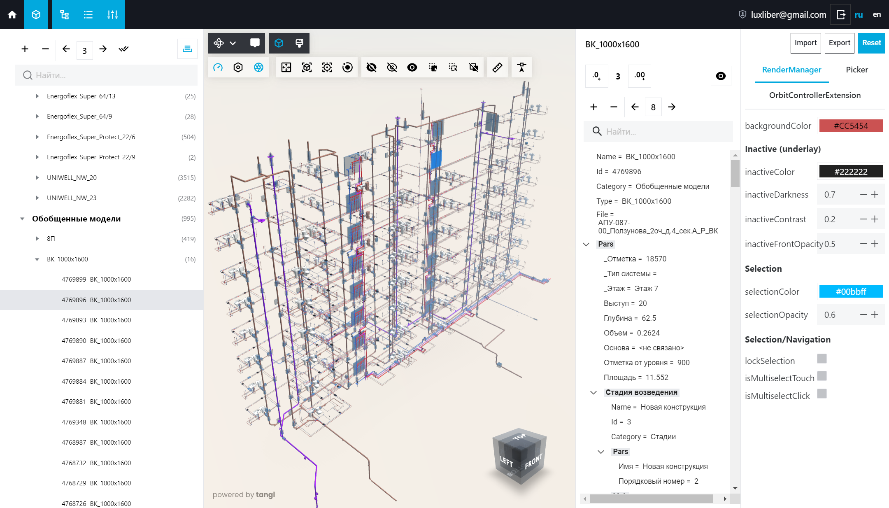

# Tangl Demo Playground Application

This demo application illustrates the embedding of the Tangl viewer and its UI library. It is designed as a playground with different settings to make it easier for third-party developers to understand how a function or API is implemented.

The playground also contains two example extensions for the viewer.

## Overview

See demo application overview on Tangl help center:

**[https://help.tangl.cloud/api/tangl-viewer/tangl-viewer-howto/tangl-demo-playground-overview.html](https://help.tangl.cloud/api/tangl-viewer/tangl-viewer-howto/tangl-demo-playground-overview.html)**

## Screenshots

